# Lovendo Database Entity-Relationship Diagram

## Complete ERD (Mermaid)

```mermaid
erDiagram
    %% ============================
    %% CORE DOMAIN
    %% ============================

    users {
        uuid id PK
        text email UK
        text full_name
        text avatar_url
        text bio
        text location
        date date_of_birth
        text gender
        text phone
        text[] languages
        text[] interests
        decimal rating
        int review_count
        boolean verified
        text kyc_status
        text push_token
        jsonb notification_preferences
        jsonb privacy_settings
        decimal balance
        text currency
        timestamptz created_at
        timestamptz updated_at
        timestamptz last_seen_at
        timestamptz deleted_at
    }

    moments {
        uuid id PK
        uuid user_id FK
        text title
        text description
        text category
        text location
        geography coordinates
        timestamptz date
        int duration_hours
        int max_participants
        int current_participants
        decimal price
        text currency
        text[] images
        text[] tags
        text requirements
        text status
        boolean is_featured
        timestamptz created_at
        timestamptz updated_at
    }

    requests {
        uuid id PK
        uuid moment_id FK
        uuid user_id FK
        text message
        text status
        timestamptz created_at
        timestamptz updated_at
        timestamptz responded_at
    }

    %% ============================
    %% MESSAGING DOMAIN
    %% ============================

    conversations {
        uuid id PK
        uuid[] participant_ids
        uuid moment_id FK
        uuid last_message_id FK
        boolean migrated_to_junction
        timestamptz created_at
        timestamptz updated_at
    }

    conversation_participants {
        uuid id PK
        uuid conversation_id FK
        uuid user_id FK
        boolean is_archived
        timestamptz last_read_at
        timestamptz joined_at
    }

    messages {
        uuid id PK
        uuid conversation_id FK
        uuid sender_id FK
        text content
        text type
        jsonb metadata
        timestamptz read_at
        timestamptz created_at
    }

    %% ============================
    %% TRUST & SAFETY DOMAIN
    %% ============================

    reviews {
        uuid id PK
        uuid moment_id FK
        uuid reviewer_id FK
        uuid reviewed_id FK
        int rating
        text comment
        timestamptz created_at
    }

    kyc_verifications {
        uuid id PK
        uuid user_id FK
        text provider
        text provider_id
        text status
        numeric confidence
        text[] rejection_reasons
        jsonb metadata
        timestamptz created_at
        timestamptz updated_at
    }

    reports {
        uuid id PK
        uuid reporter_id FK
        uuid reported_user_id FK
        uuid reported_moment_id FK
        text reason
        text description
        text status
        timestamptz created_at
        timestamptz resolved_at
    }

    blocks {
        uuid id PK
        uuid blocker_id FK
        uuid blocked_id FK
        timestamptz created_at
    }

    proof_verifications {
        uuid id PK
        uuid user_id FK
        uuid moment_id FK
        text status
        jsonb verification_data
        timestamptz created_at
    }

    %% ============================
    %% PAYMENT DOMAIN
    %% ============================

    transactions {
        uuid id PK
        uuid user_id FK
        uuid moment_id FK
        text type
        decimal amount
        text currency
        text status
        text description
        jsonb metadata
        timestamptz created_at
    }

    escrow_transactions {
        uuid id PK
        uuid sender_id FK
        uuid recipient_id FK
        decimal amount
        text currency
        uuid moment_id FK
        text status
        text release_condition
        boolean proof_submitted
        boolean proof_verified
        timestamptz proof_verification_date
        timestamptz created_at
        timestamptz expires_at
        timestamptz released_at
        jsonb metadata
    }

    subscription_plans {
        text id PK
        text name
        decimal price
        text interval
        jsonb features
        boolean is_popular
        text color
        text icon
        boolean is_active
    }

    user_subscriptions {
        uuid id PK
        uuid user_id FK
        text plan_id FK
        text status
        timestamptz current_period_start
        timestamptz current_period_end
        boolean cancel_at_period_end
        text provider
        text provider_subscription_id
    }

    %% ============================
    %% SOCIAL DOMAIN
    %% ============================

    favorites {
        uuid id PK
        uuid user_id FK
        uuid moment_id FK
        timestamptz created_at
    }

    notifications {
        uuid id PK
        uuid user_id FK
        text type
        text title
        text body
        jsonb data
        boolean read
        timestamptz created_at
    }

    %% ============================
    %% ADMIN DOMAIN
    %% ============================

    admin_users {
        uuid id PK
        text email UK
        text name
        text avatar_url
        text role
        boolean is_active
        boolean requires_2fa
        text totp_secret
        boolean totp_enabled
        timestamptz last_login_at
        timestamptz created_at
    }

    admin_sessions {
        uuid id PK
        uuid admin_id FK
        text token_hash
        text ip_address
        text user_agent
        timestamptz expires_at
        timestamptz created_at
    }

    audit_logs {
        uuid id PK
        uuid user_id FK
        text action
        text ip_address
        text user_agent
        jsonb metadata
        timestamptz created_at
    }

    role_permissions {
        uuid id PK
        text role
        text resource
        text action
    }

    tasks {
        uuid id PK
        text type
        text title
        text description
        text priority
        text status
        text resource_type
        text resource_id
        uuid assigned_to FK
        text[] assigned_roles
        timestamptz due_date
        jsonb metadata
        timestamptz created_at
        timestamptz completed_at
    }

    %% ============================
    %% INFRASTRUCTURE DOMAIN
    %% ============================

    feed_delta {
        uuid user_id FK
        text item_id
        text item_type
        text operation
        jsonb data
        bigserial version PK
        timestamptz created_at
    }

    rate_limits {
        uuid id PK
        text key
        int count
        timestamptz window_start
    }

    cdn_invalidation_logs {
        uuid id PK
        text type
        text[] urls
        text[] item_ids
        boolean success
        int latency_ms
        text error
        timestamptz created_at
    }

    cache_invalidation {
        uuid id PK
        text cache_key
        timestamptz invalidated_at
    }

    deep_link_events {
        uuid id PK
        uuid user_id FK
        text session_id
        text source
        text type
        text url
        text campaign
        text medium
        text content
        text term
        text target_screen
        text landing_screen
        text drop_off_screen
        boolean completed
        int time_to_land
        int time_to_complete
        jsonb params
        timestamptz created_at
        timestamptz completed_at
    }

    %% ============================
    %% RELATIONSHIPS
    %% ============================

    users ||--o{ moments : "creates"
    users ||--o{ requests : "makes"
    users ||--o{ reviews : "writes"
    users ||--o{ reviews : "receives"
    users ||--o{ notifications : "receives"
    users ||--o{ favorites : "saves"
    users ||--o{ transactions : "has"
    users ||--o{ blocks : "blocks"
    users ||--o{ blocks : "blocked_by"
    users ||--o{ reports : "reports"
    users ||--o{ reports : "reported"
    users ||--o{ kyc_verifications : "verifies"
    users ||--o{ user_subscriptions : "subscribes"
    users ||--o{ audit_logs : "generates"
    users ||--o{ escrow_transactions : "sends"
    users ||--o{ escrow_transactions : "receives"
    users ||--o{ deep_link_events : "triggers"
    users ||--o{ feed_delta : "receives"
    users ||--o{ proof_verifications : "submits"
    users ||--o{ conversation_participants : "participates"
    users ||--o{ messages : "sends"

    moments ||--o{ requests : "receives"
    moments ||--o{ favorites : "favorited"
    moments ||--o{ reviews : "reviewed_in"
    moments ||--o{ reports : "reported"
    moments ||--o{ transactions : "associated"
    moments ||--o{ escrow_transactions : "escrow_for"
    moments ||--o{ proof_verifications : "verified_for"
    moments ||--o| conversations : "discussed_in"

    conversations ||--o{ messages : "contains"
    conversations ||--o{ conversation_participants : "includes"
    conversations ||--o| messages : "last_message"

    subscription_plans ||--o{ user_subscriptions : "subscribed"

    admin_users ||--o{ admin_sessions : "has"
    admin_users ||--o{ tasks : "assigned"
```



## Domain Breakdown

### Core Domain

```
┌──────────────────────────────────────────────────────────────────┐
│                         CORE DOMAIN                               │
│                                                                    │
│   ┌─────────┐         creates         ┌─────────────┐            │
│   │  USERS  │─────────────────────────▶│   MOMENTS   │            │
│   └────┬────┘                          └──────┬──────┘            │
│        │                                      │                   │
│        │ makes                                │ receives          │
│        ▼                                      ▼                   │
│   ┌─────────────┐                       ┌───────────┐            │
│   │  REQUESTS   │◀──────────────────────│  REQUESTS │            │
│   │ (requester) │                       │  (moment) │            │
│   └─────────────┘                       └───────────┘            │
│                                                                    │
│   Constraints:                                                     │
│   - One request per user per moment (UNIQUE constraint)           │
│   - Status state machine: pending → accepted/rejected/cancelled   │
│   - Participant count auto-updates via triggers                   │
└──────────────────────────────────────────────────────────────────┘
```

### Messaging Domain

```
┌──────────────────────────────────────────────────────────────────┐
│                       MESSAGING DOMAIN                            │
│                                                                    │
│   ┌───────────────────┐                                           │
│   │   CONVERSATIONS   │                                           │
│   │                   │                                           │
│   │ - participant_ids │ (legacy array)                            │
│   │ - moment_id       │ (optional link to moment)                 │
│   │ - last_message_id │ (denormalized for perf)                   │
│   └────────┬──────────┘                                           │
│            │                                                       │
│       1:N  │                                                       │
│            ▼                                                       │
│   ┌───────────────────────────────┐                               │
│   │ CONVERSATION_PARTICIPANTS     │ (normalized junction)         │
│   │                               │                               │
│   │ - conversation_id             │                               │
│   │ - user_id                     │                               │
│   │ - is_archived                 │ (per-user archive)            │
│   │ - last_read_at                │ (read receipts)               │
│   └───────────────────────────────┘                               │
│            │                                                       │
│       N:1  │                                                       │
│            ▼                                                       │
│   ┌───────────────────┐                                           │
│   │     MESSAGES      │                                           │
│   │                   │                                           │
│   │ - sender_id       │                                           │
│   │ - content         │                                           │
│   │ - type            │ (text, image, location, system)           │
│   │ - read_at         │                                           │
│   └───────────────────┘                                           │
│                                                                    │
│   Realtime: ENABLED (Supabase Realtime subscriptions)             │
└──────────────────────────────────────────────────────────────────┘
```

### Payment Domain

```
┌──────────────────────────────────────────────────────────────────┐
│                        PAYMENT DOMAIN                             │
│                                                                    │
│   ┌─────────────────────┐                                         │
│   │    TRANSACTIONS     │ (all financial movements)               │
│   │                     │                                         │
│   │ Types:              │                                         │
│   │ - deposit           │ (funds in)                              │
│   │ - withdrawal        │ (funds out)                             │
│   │ - payment           │ (moment payment)                        │
│   │ - refund            │ (reversal)                              │
│   │ - gift              │ (gift exchange)                         │
│   │ - escrow_hold       │ (escrow lock)                           │
│   │ - escrow_release    │ (escrow unlock)                         │
│   └─────────────────────┘                                         │
│                                                                    │
│   ┌─────────────────────────────────────────────────────────────┐ │
│   │                    ESCROW SYSTEM                             │ │
│   │                                                              │ │
│   │  ┌─────────┐    holds    ┌──────────────────┐               │ │
│   │  │ SENDER  │─────────────▶│ ESCROW_TRANSACTION │              │ │
│   │  └─────────┘              │                    │              │ │
│   │                           │ status:            │              │ │
│   │                           │ - pending          │              │ │
│   │                           │ - released         │──▶ RECIPIENT │ │
│   │                           │ - refunded         │──▶ SENDER    │ │
│   │                           │ - disputed         │              │ │
│   │                           │ - expired          │──▶ auto-refund│ │
│   │                           └──────────────────┘               │ │
│   │                                                              │ │
│   │  Proof verification flow:                                    │ │
│   │  1. Sender creates escrow (funds locked)                     │ │
│   │  2. Recipient submits proof                                  │ │
│   │  3. Proof verified → funds released                          │ │
│   │  4. Or: 7 days expire → auto-refund via pg_cron              │ │
│   └─────────────────────────────────────────────────────────────┘ │
│                                                                    │
│   ┌─────────────────────────────────────────────────────────────┐ │
│   │                  SUBSCRIPTION SYSTEM                         │ │
│   │                                                              │ │
│   │  ┌────────────────────┐         ┌─────────────────────┐     │ │
│   │  │ SUBSCRIPTION_PLANS │────────▶│ USER_SUBSCRIPTIONS  │     │ │
│   │  │                    │         │                     │     │ │
│   │  │ - free             │         │ - user_id           │     │ │
│   │  │ - starter ($10)    │         │ - plan_id           │     │ │
│   │  │ - pro ($25)        │         │ - status            │     │ │
│   │  │ - vip ($50)        │         │ - provider (paytr)  │     │ │
│   │  └────────────────────┘         └─────────────────────┘     │ │
│   └─────────────────────────────────────────────────────────────┘ │
└──────────────────────────────────────────────────────────────────┘
```

### Trust & Safety Domain

```
┌──────────────────────────────────────────────────────────────────┐
│                     TRUST & SAFETY DOMAIN                         │
│                                                                    │
│   ┌───────────────────────────────────────────────────────────┐   │
│   │                    TRUST SCORE SYSTEM                      │   │
│   │                                                            │   │
│   │   ┌─────────┐     writes     ┌─────────┐                  │   │
│   │   │ REVIEWER│───────────────▶│ REVIEWS │                  │   │
│   │   └─────────┘                └────┬────┘                  │   │
│   │                                   │                        │   │
│   │                              aggregates                    │   │
│   │                                   ▼                        │   │
│   │                            ┌───────────┐                  │   │
│   │                            │   USERS   │                  │   │
│   │                            │  (rating) │                  │   │
│   │                            └───────────┘                  │   │
│   │                                                            │   │
│   │   Trigger: update_user_rating() calculates AVG(rating)    │   │
│   └───────────────────────────────────────────────────────────┘   │
│                                                                    │
│   ┌───────────────────────────────────────────────────────────┐   │
│   │                    KYC VERIFICATION                        │   │
│   │                                                            │   │
│   │   ┌─────────┐    verifies    ┌───────────────────┐        │   │
│   │   │  USERS  │───────────────▶│ KYC_VERIFICATIONS │        │   │
│   │   │         │                │                   │        │   │
│   │   │kyc_status│◀──────────────│ - provider        │        │   │
│   │   │         │    updates     │ - confidence      │        │   │
│   │   └─────────┘                │ - status          │        │   │
│   │                              └───────────────────┘        │   │
│   │                                                            │   │
│   │   Providers: onfido, mock                                 │   │
│   └───────────────────────────────────────────────────────────┘   │
│                                                                    │
│   ┌───────────────────────────────────────────────────────────┐   │
│   │                    MODERATION SYSTEM                       │   │
│   │                                                            │   │
│   │   ┌─────────┐                ┌─────────┐                  │   │
│   │   │ REPORTS │ (user/moment)  │ BLOCKS  │ (user↔user)     │   │
│   │   │         │                │         │                  │   │
│   │   │ status: │                │         │                  │   │
│   │   │-pending │                │         │                  │   │
│   │   │-reviewed│                │         │                  │   │
│   │   │-resolved│                │         │                  │   │
│   │   │-dismissed                │         │                  │   │
│   │   └─────────┘                └─────────┘                  │   │
│   └───────────────────────────────────────────────────────────┘   │
└──────────────────────────────────────────────────────────────────┘
```

### Admin Domain

```
┌──────────────────────────────────────────────────────────────────┐
│                        ADMIN DOMAIN                               │
│                                                                    │
│   ┌─────────────────────────────────────────────────────────────┐ │
│   │                   RBAC (Role-Based Access Control)          │ │
│   │                                                              │ │
│   │   Roles:                                                     │ │
│   │   ├── super_admin  (full access)                            │ │
│   │   ├── manager      (team management)                        │ │
│   │   ├── moderator    (content moderation)                     │ │
│   │   ├── finance      (payment operations)                     │ │
│   │   ├── marketing    (campaigns, analytics)                   │ │
│   │   ├── support      (user support)                           │ │
│   │   └── viewer       (read-only)                              │ │
│   │                                                              │ │
│   │   ┌─────────────┐        ┌─────────────────────┐            │ │
│   │   │ ADMIN_USERS │────────│ ROLE_PERMISSIONS    │            │ │
│   │   │             │        │                     │            │ │
│   │   │ - role      │        │ - resource          │            │ │
│   │   │ - 2FA       │        │ - action            │            │ │
│   │   └─────────────┘        └─────────────────────┘            │ │
│   └─────────────────────────────────────────────────────────────┘ │
│                                                                    │
│   ┌─────────────────────────────────────────────────────────────┐ │
│   │                      AUDIT TRAIL                             │ │
│   │                                                              │ │
│   │   ┌─────────────┐                                           │ │
│   │   │ AUDIT_LOGS  │ (immutable append-only)                   │ │
│   │   │             │                                           │ │
│   │   │ - user_id   │ (who)                                     │ │
│   │   │ - action    │ (what)                                    │ │
│   │   │ - ip_address│ (where)                                   │ │
│   │   │ - metadata  │ (details)                                 │ │
│   │   │ - timestamp │ (when)                                    │ │
│   │   └─────────────┘                                           │ │
│   │                                                              │ │
│   │   No DELETE policy - audit logs are permanent               │ │
│   └─────────────────────────────────────────────────────────────┘ │
│                                                                    │
│   ┌─────────────────────────────────────────────────────────────┐ │
│   │                      TASK MANAGEMENT                         │ │
│   │                                                              │ │
│   │   ┌─────────────┐                                           │ │
│   │   │   TASKS     │ (admin work queue)                        │ │
│   │   │             │                                           │ │
│   │   │ Types:      │ Priorities:   │ Status:                   │ │
│   │   │ - review    │ - urgent      │ - pending                 │ │
│   │   │ - moderate  │ - high        │ - in_progress             │ │
│   │   │ - verify    │ - medium      │ - completed               │ │
│   │   │ - support   │ - low         │ - cancelled               │ │
│   │   └─────────────┘                                           │ │
│   └─────────────────────────────────────────────────────────────┘ │
└──────────────────────────────────────────────────────────────────┘
```

## Relationship Cardinality Summary

| Relationship                            | Cardinality | Description                      |
| --------------------------------------- | ----------- | -------------------------------- |
| users → moments                         | 1:N         | User creates many moments        |
| users → requests                        | 1:N         | User makes many requests         |
| moments → requests                      | 1:N         | Moment receives many requests    |
| users → reviews (reviewer)              | 1:N         | User writes many reviews         |
| users → reviews (reviewed)              | 1:N         | User receives many reviews       |
| moments → reviews                       | 1:N         | Moment has many reviews          |
| users ↔ conversations                   | N:M         | Via conversation_participants    |
| conversations → messages                | 1:N         | Conversation has many messages   |
| users → messages                        | 1:N         | User sends many messages         |
| users → notifications                   | 1:N         | User receives many notifications |
| users → favorites                       | 1:N         | User has many favorites          |
| moments → favorites                     | 1:N         | Moment has many favorites        |
| users → transactions                    | 1:N         | User has many transactions       |
| users → escrow (sender)                 | 1:N         | User sends many escrows          |
| users → escrow (recipient)              | 1:N         | User receives many escrows       |
| subscription_plans → user_subscriptions | 1:N         | Plan has many subscribers        |
| users → user_subscriptions              | 1:N         | User has subscription history    |
| users → kyc_verifications               | 1:N         | User has verification history    |
| users ↔ blocks                          | N:M         | Self-referential many-to-many    |
| users → reports (reporter)              | 1:N         | User files many reports          |
| users/moments → reports (reported)      | 1:N         | Entity receives many reports     |
| admin_users → admin_sessions            | 1:N         | Admin has many sessions          |
| admin_users → tasks                     | 1:N         | Admin assigned many tasks        |
| users → audit_logs                      | 1:N         | User generates many logs         |

---

_Last Updated: 2025-12-22_
