# Lovendo C4 Model Architecture

> **Version**: 1.0.0
> **Last Updated**: December 2024

This document provides detailed C4 model diagrams for the Lovendo platform using Mermaid syntax for easy visualization in GitHub and other Markdown viewers.

## Table of Contents

1. [Level 1: System Context](#level-1-system-context)
2. [Level 2: Container Diagram](#level-2-container-diagram)
3. [Level 3: Component Diagrams](#level-3-component-diagrams)
4. [Level 4: Code Level](#level-4-code-level)
5. [Dynamic Diagrams](#dynamic-diagrams)

---

## Level 1: System Context

The System Context diagram shows Lovendo and its relationships with users and external systems.

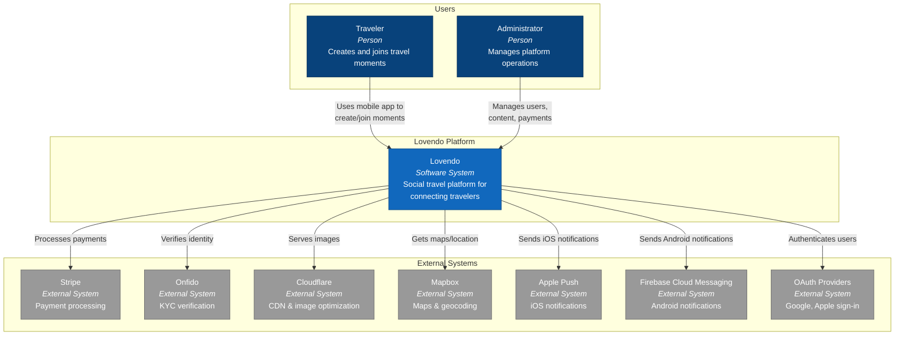

### External System Integrations

| System | Purpose | Protocol | Data Exchanged |
|--------|---------|----------|----------------|
| **Stripe** | Payment processing | REST API | Payment intents, webhooks, customer data |
| **Onfido** | Identity verification | REST API | Document images, verification results |
| **Cloudflare** | CDN & optimization | REST API | Images, cache invalidation |
| **Mapbox** | Maps & geocoding | Native SDK | Coordinates, map tiles |
| **APNs/FCM** | Push notifications | Native SDK | Notification payloads |
| **OAuth** | Social authentication | OAuth 2.0 | Access tokens, user profiles |

---

## Level 2: Container Diagram

The Container diagram shows the high-level technology choices and how containers communicate.

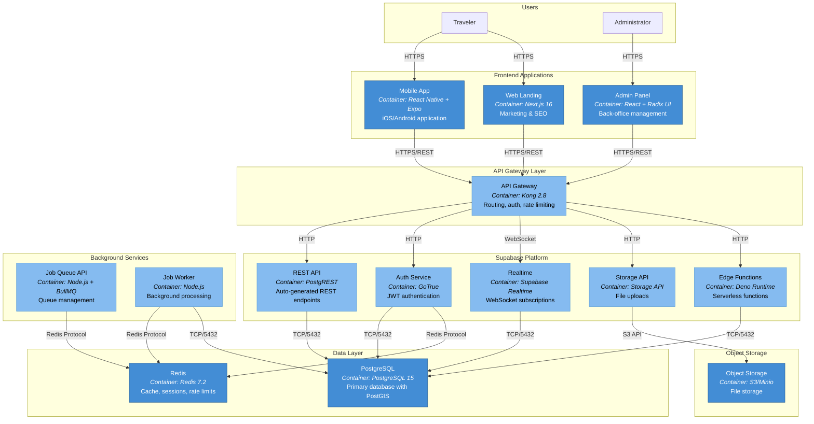

### Container Descriptions

| Container | Technology | Responsibility | Port |
|-----------|------------|----------------|------|
| Mobile App | React Native + Expo | User-facing mobile application | N/A |
| Web Landing | Next.js 16 | Marketing pages, SEO | 3000 |
| Admin Panel | React + Radix UI | Administrative interface | 3001 |
| API Gateway | Kong 2.8 | Request routing, auth, rate limiting | 8000 |
| REST API | PostgREST | Auto-generated REST from PostgreSQL | 3000 |
| Auth Service | GoTrue | Authentication, JWT issuance | 9999 |
| Realtime | Supabase Realtime | WebSocket connections | 4000 |
| Storage API | Supabase Storage | File upload/download | 5000 |
| Edge Functions | Deno | Custom serverless logic | Dynamic |
| PostgreSQL | PostgreSQL 15 | Primary data storage | 5432 |
| Redis | Redis 7.2 | Caching, sessions, queues | 6379 |
| Job Queue | Node.js + BullMQ | Background job management | 3002 |
| Object Storage | S3/Minio | Binary file storage | 9000 |

---

## Level 3: Component Diagrams

### Mobile Application Components

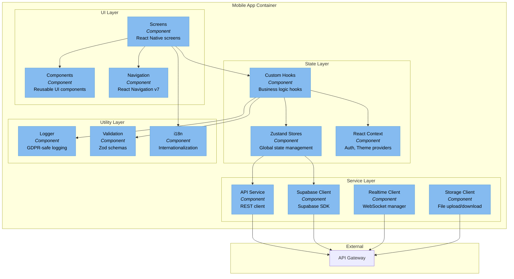

### Mobile App Directory Structure

```
apps/mobile/src/
├── components/          # Reusable UI components
│   ├── ui/             # Base UI primitives
│   ├── forms/          # Form components
│   └── cards/          # Card layouts
├── screens/            # Screen components
│   ├── auth/           # Authentication screens
│   ├── home/           # Home & discovery
│   ├── moments/        # Moment management
│   ├── chat/           # Messaging
│   └── profile/        # User profile
├── navigation/         # Navigation configuration
├── stores/             # Zustand state stores
├── hooks/              # Custom React hooks
├── services/           # API & external services
├── context/            # React context providers
├── utils/              # Utility functions
├── constants/          # Design tokens & constants
├── types/              # TypeScript definitions
├── schemas/            # Zod validation schemas
├── i18n/               # Internationalization
└── features/           # Feature modules
```

### Edge Functions Components

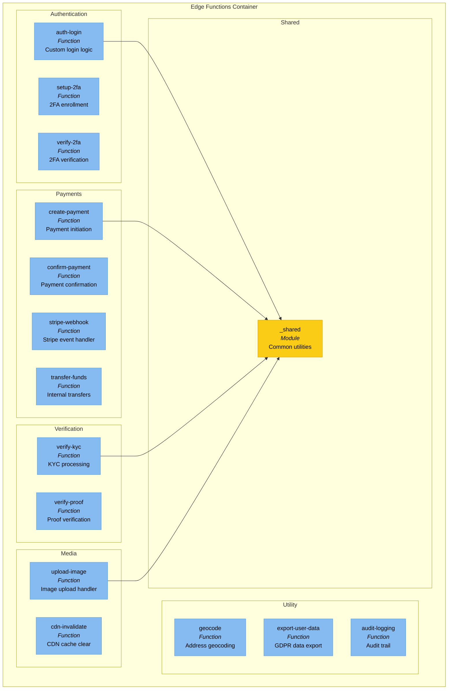

### Admin Panel Components

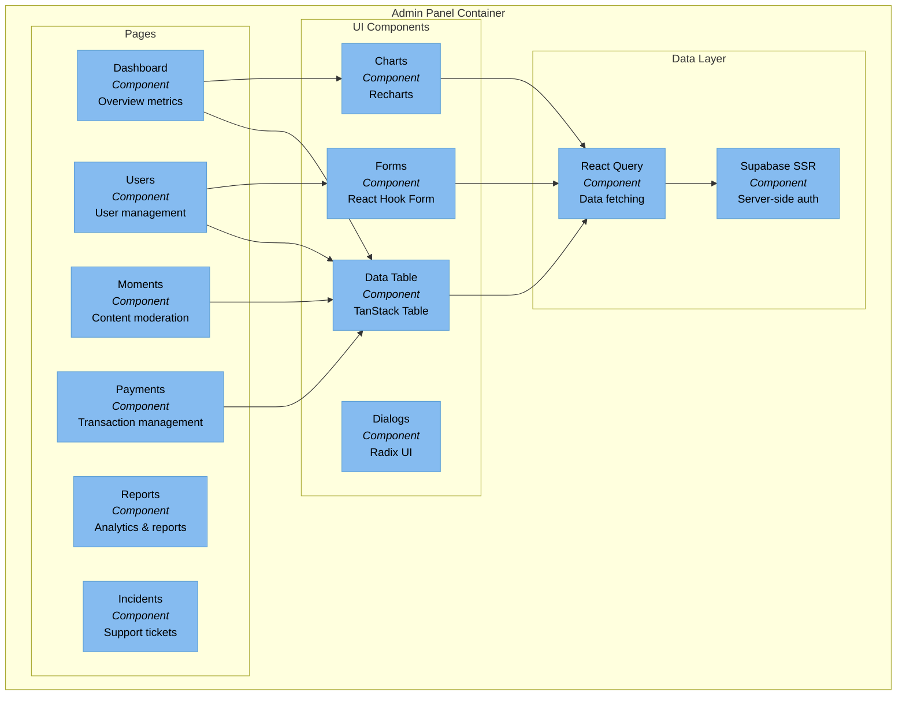

---

## Level 4: Code Level

### Store Architecture (Zustand)

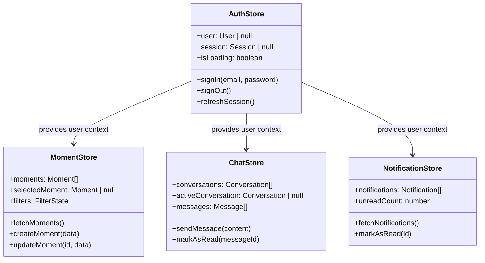

### Service Layer Pattern

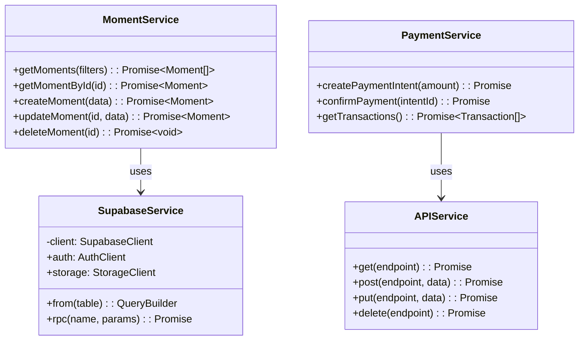

---

## Dynamic Diagrams

### Authentication Flow

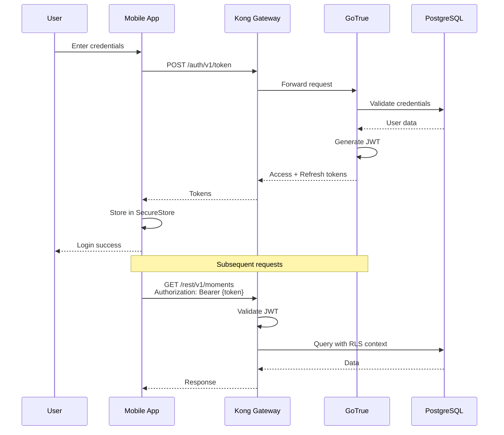

### Moment Creation Flow

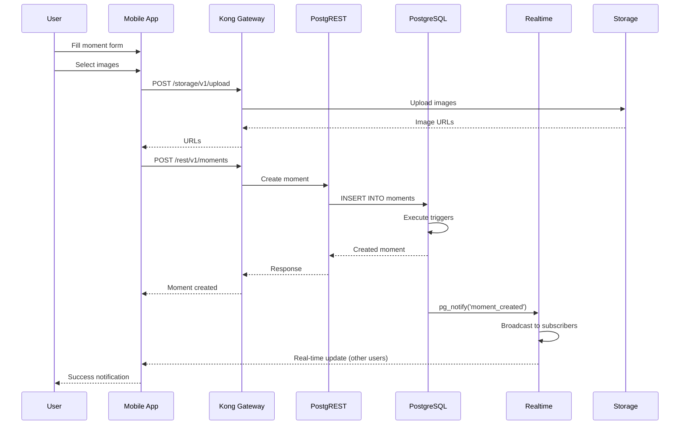

### Payment Flow

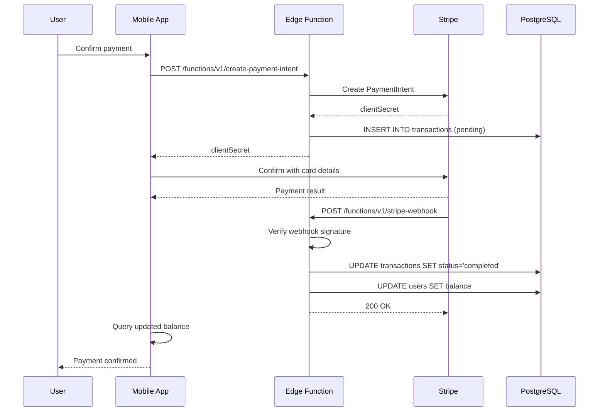

### Real-time Messaging Flow

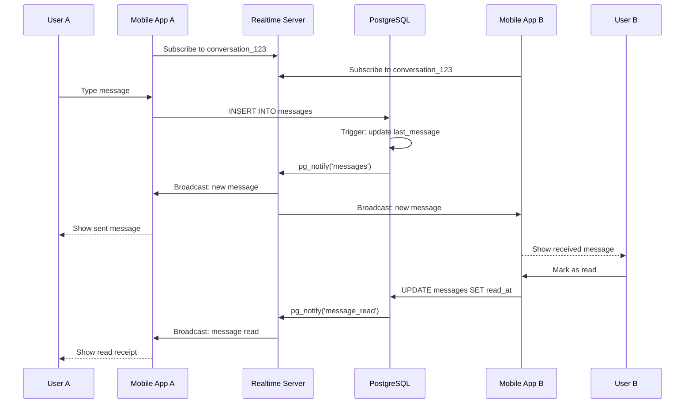

---

## Deployment View

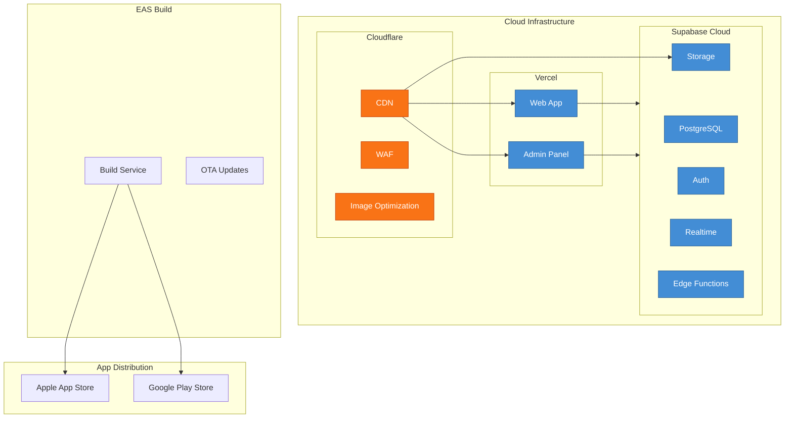

---

## Related Documents

- [Architecture Overview](./ARCHITECTURE.md)
- [Data Architecture](./DATA_ARCHITECTURE.md)
- [Security Architecture](./SECURITY_ARCHITECTURE.md)
- [ADR Index](./adr/README.md)
