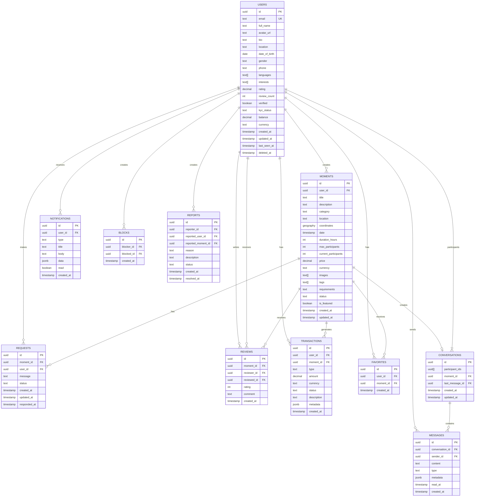
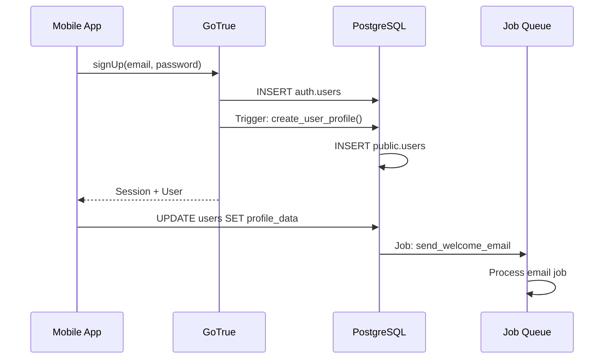
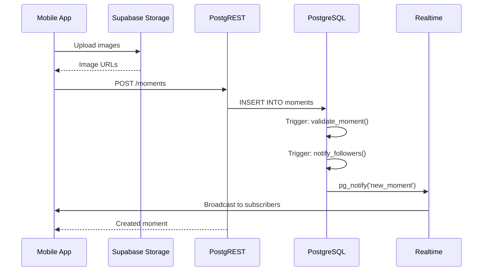
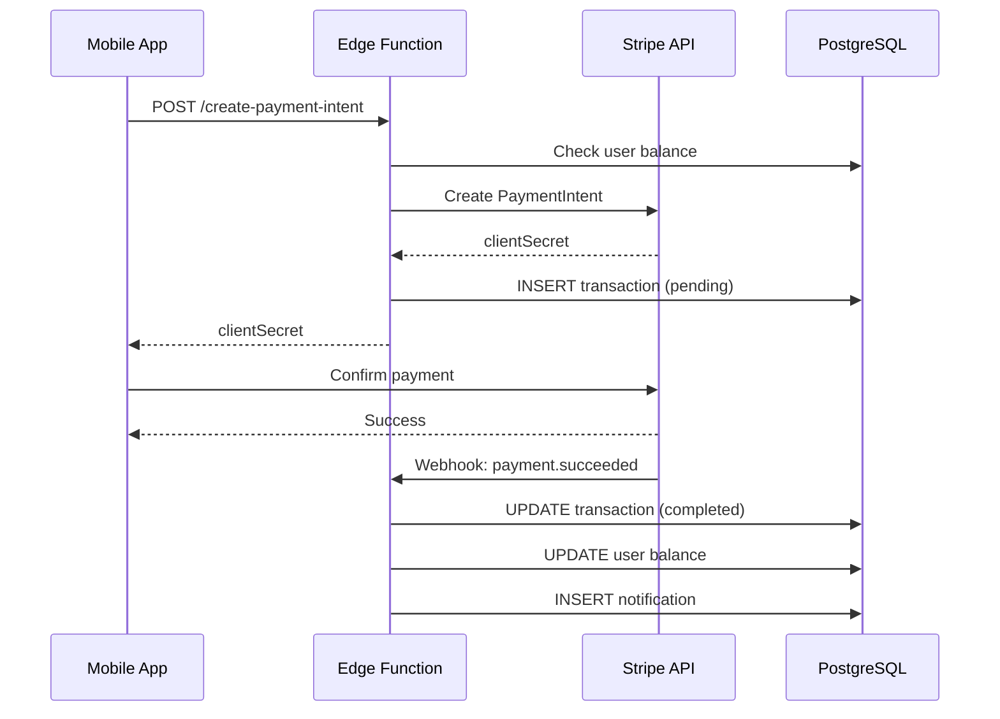
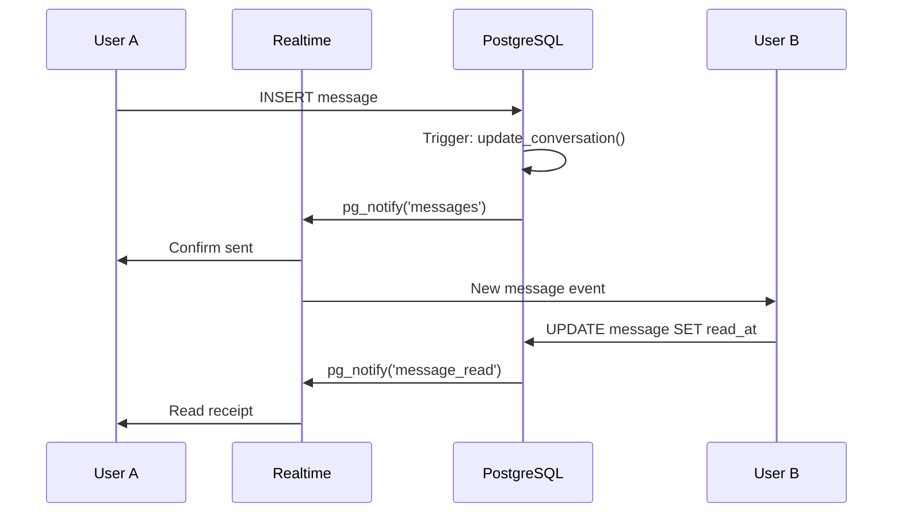

# Lovendo Data Architecture

> **Version**: 1.0.0 **Last Updated**: December 2024

This document describes the data architecture of Lovendo, including database design, data flows, and
storage patterns.

## Table of Contents

1. [Database Overview](#database-overview)
2. [Entity Relationship Diagram](#entity-relationship-diagram)
3. [Table Definitions](#table-definitions)
4. [Data Flows](#data-flows)
5. [Indexing Strategy](#indexing-strategy)
6. [Data Lifecycle](#data-lifecycle)
7. [Backup and Recovery](#backup-and-recovery)

---

## Database Overview

### Technology Stack

| Component          | Technology         | Purpose                       |
| ------------------ | ------------------ | ----------------------------- |
| Primary Database   | PostgreSQL 15      | OLTP workloads                |
| Extensions         | PostGIS, uuid-ossp | Geospatial, UUID generation   |
| Connection Pooling | PgBouncer          | Connection management         |
| Cache Layer        | Redis 7.2          | Session, rate limiting, cache |
| Object Storage     | S3/Minio           | File storage                  |

### Database Configuration

```sql
-- Key PostgreSQL settings
shared_buffers = 256MB
work_mem = 16MB
maintenance_work_mem = 128MB
effective_cache_size = 768MB
random_page_cost = 1.1
max_connections = 200
```

---

## Entity Relationship Diagram



---

## Table Definitions

### Core Tables

#### Users Table

```sql
CREATE TABLE users (
  id UUID PRIMARY KEY DEFAULT uuid_generate_v4(),
  email TEXT UNIQUE NOT NULL,
  full_name TEXT NOT NULL,
  avatar_url TEXT,
  bio TEXT,
  location TEXT,
  date_of_birth DATE,
  gender TEXT CHECK (gender IN ('male', 'female', 'other', 'prefer_not_to_say')),
  phone TEXT,
  languages TEXT[] DEFAULT '{}',
  interests TEXT[] DEFAULT '{}',
  rating DECIMAL(2,1) DEFAULT 0,
  review_count INTEGER DEFAULT 0,
  verified BOOLEAN DEFAULT FALSE,
  kyc_status TEXT DEFAULT 'pending' CHECK (kyc_status IN ('pending', 'verified', 'rejected')),
  push_token TEXT,
  notification_preferences JSONB DEFAULT '{"messages": true, "requests": true, "reminders": true, "marketing": false}',
  privacy_settings JSONB DEFAULT '{"showOnlineStatus": true, "showLastSeen": true}',
  balance DECIMAL(10,2) DEFAULT 0,
  currency TEXT DEFAULT 'TRY',
  created_at TIMESTAMPTZ DEFAULT NOW(),
  updated_at TIMESTAMPTZ DEFAULT NOW(),
  last_seen_at TIMESTAMPTZ DEFAULT NOW(),
  deleted_at TIMESTAMPTZ  -- Soft delete for GDPR
);
```

#### Moments Table

```sql
CREATE TABLE moments (
  id UUID PRIMARY KEY DEFAULT uuid_generate_v4(),
  user_id UUID REFERENCES users(id) ON DELETE CASCADE NOT NULL,
  title TEXT NOT NULL,
  description TEXT,
  category TEXT NOT NULL,
  location TEXT NOT NULL,
  coordinates GEOGRAPHY(POINT, 4326),  -- PostGIS geospatial
  date TIMESTAMPTZ NOT NULL,
  duration_hours INTEGER,
  max_participants INTEGER DEFAULT 1,
  current_participants INTEGER DEFAULT 0,
  price DECIMAL(10,2) DEFAULT 0,
  currency TEXT DEFAULT 'TRY',
  images TEXT[] DEFAULT '{}',
  tags TEXT[] DEFAULT '{}',
  requirements TEXT,
  status TEXT DEFAULT 'active' CHECK (status IN ('draft', 'active', 'full', 'completed', 'cancelled')),
  is_featured BOOLEAN DEFAULT FALSE,
  created_at TIMESTAMPTZ DEFAULT NOW(),
  updated_at TIMESTAMPTZ DEFAULT NOW()
);
```

### Supporting Tables

#### Subscriptions Table (Premium Features)

```sql
CREATE TABLE subscriptions (
  id UUID PRIMARY KEY DEFAULT uuid_generate_v4(),
  user_id UUID REFERENCES users(id) ON DELETE CASCADE NOT NULL,
  plan TEXT NOT NULL CHECK (plan IN ('free', 'premium', 'business')),
  status TEXT DEFAULT 'active' CHECK (status IN ('active', 'cancelled', 'expired')),
  paytr_subscription_id TEXT,
  current_period_start TIMESTAMPTZ,
  current_period_end TIMESTAMPTZ,
  created_at TIMESTAMPTZ DEFAULT NOW(),
  updated_at TIMESTAMPTZ DEFAULT NOW()
);
```

#### KYC Verifications Table

```sql
CREATE TABLE kyc_verifications (
  id UUID PRIMARY KEY DEFAULT uuid_generate_v4(),
  user_id UUID REFERENCES users(id) ON DELETE CASCADE NOT NULL,
  provider TEXT DEFAULT 'onfido',
  external_id TEXT,  -- Onfido applicant ID
  status TEXT DEFAULT 'pending' CHECK (status IN ('pending', 'processing', 'approved', 'rejected')),
  document_type TEXT,
  verification_data JSONB,
  rejection_reason TEXT,
  created_at TIMESTAMPTZ DEFAULT NOW(),
  updated_at TIMESTAMPTZ DEFAULT NOW(),
  verified_at TIMESTAMPTZ
);
```

---

## Data Flows

### 1. User Registration Flow



### 2. Moment Creation Flow



### 3. Payment Flow



### 4. Real-time Messaging Flow



---

## Indexing Strategy

### Primary Indexes

```sql
-- Users
CREATE INDEX idx_users_email ON users(email);
CREATE INDEX idx_users_location ON users(location);
CREATE INDEX idx_users_kyc_status ON users(kyc_status);
CREATE INDEX idx_users_created_at ON users(created_at DESC);

-- Moments
CREATE INDEX idx_moments_user_id ON moments(user_id);
CREATE INDEX idx_moments_status ON moments(status);
CREATE INDEX idx_moments_category ON moments(category);
CREATE INDEX idx_moments_date ON moments(date);
CREATE INDEX idx_moments_created_at ON moments(created_at DESC);
CREATE INDEX idx_moments_coordinates ON moments USING GIST(coordinates);

-- Messages
CREATE INDEX idx_messages_conversation_id ON messages(conversation_id);
CREATE INDEX idx_messages_sender_id ON messages(sender_id);
CREATE INDEX idx_messages_created_at ON messages(created_at DESC);

-- Notifications
CREATE INDEX idx_notifications_user_id ON notifications(user_id);
CREATE INDEX idx_notifications_read ON notifications(read);
CREATE INDEX idx_notifications_created_at ON notifications(created_at DESC);
```

### Composite Indexes

```sql
-- Optimized for common queries
CREATE INDEX idx_moments_status_date ON moments(status, date) WHERE status = 'active';
CREATE INDEX idx_requests_moment_status ON requests(moment_id, status);
CREATE INDEX idx_favorites_user_moment ON favorites(user_id, moment_id);
CREATE INDEX idx_blocks_users ON blocks(blocker_id, blocked_id);
```

### Full-Text Search

```sql
-- Full-text search on moments
CREATE INDEX idx_moments_fts ON moments USING GIN(
  to_tsvector('english', coalesce(title, '') || ' ' || coalesce(description, ''))
);

-- Search function
CREATE OR REPLACE FUNCTION search_moments(search_term TEXT)
RETURNS SETOF moments
LANGUAGE sql
STABLE
AS $$
  SELECT *
  FROM moments
  WHERE to_tsvector('english', coalesce(title, '') || ' ' || coalesce(description, ''))
        @@ plainto_tsquery('english', search_term)
  ORDER BY ts_rank(
    to_tsvector('english', coalesce(title, '') || ' ' || coalesce(description, '')),
    plainto_tsquery('english', search_term)
  ) DESC;
$$;
```

### Geospatial Indexes

```sql
-- Find moments within radius
CREATE OR REPLACE FUNCTION find_nearby_moments(
  lat DOUBLE PRECISION,
  lng DOUBLE PRECISION,
  radius_km INTEGER DEFAULT 50
)
RETURNS SETOF moments
LANGUAGE sql
STABLE
AS $$
  SELECT *
  FROM moments
  WHERE ST_DWithin(
    coordinates,
    ST_SetSRID(ST_MakePoint(lng, lat), 4326)::geography,
    radius_km * 1000  -- Convert to meters
  )
  AND status = 'active'
  ORDER BY coordinates <-> ST_SetSRID(ST_MakePoint(lng, lat), 4326)::geography;
$$;
```

---

## Data Lifecycle

### Data Retention Policies

| Data Type     | Retention Period | Action                      |
| ------------- | ---------------- | --------------------------- |
| Active users  | Indefinite       | None                        |
| Deleted users | 30 days          | Hard delete                 |
| Messages      | 2 years          | Archive to cold storage     |
| Notifications | 90 days          | Auto-delete                 |
| Transactions  | 7 years          | Archive (legal requirement) |
| Audit logs    | 1 year           | Archive                     |
| Session data  | 7 days           | Auto-expire                 |

### GDPR Compliance

```sql
-- Soft delete user (GDPR right to erasure)
CREATE OR REPLACE FUNCTION delete_user_data(target_user_id UUID)
RETURNS VOID
LANGUAGE plpgsql
SECURITY DEFINER
SET search_path = public
AS $$
BEGIN
  -- Soft delete user record
  UPDATE users
  SET
    deleted_at = NOW(),
    email = 'deleted_' || id || '@deleted.local',
    full_name = 'Deleted User',
    phone = NULL,
    bio = NULL,
    avatar_url = NULL,
    push_token = NULL
  WHERE id = target_user_id;

  -- Anonymize messages (keep for conversation context)
  UPDATE messages
  SET content = '[Message deleted]'
  WHERE sender_id = target_user_id;

  -- Delete notifications
  DELETE FROM notifications WHERE user_id = target_user_id;

  -- Remove from favorites
  DELETE FROM favorites WHERE user_id = target_user_id;

  -- Log deletion for compliance
  INSERT INTO audit_logs (action, entity_type, entity_id, performed_at)
  VALUES ('USER_DELETION', 'user', target_user_id, NOW());
END;
$$;
```

### Data Export (GDPR)

```sql
-- Export user data
CREATE OR REPLACE FUNCTION export_user_data(target_user_id UUID)
RETURNS JSONB
LANGUAGE plpgsql
SECURITY DEFINER
SET search_path = public
AS $$
DECLARE
  result JSONB;
BEGIN
  SELECT jsonb_build_object(
    'user', (SELECT row_to_json(u) FROM users u WHERE id = target_user_id),
    'moments', (SELECT jsonb_agg(row_to_json(m)) FROM moments m WHERE user_id = target_user_id),
    'messages', (SELECT jsonb_agg(row_to_json(msg)) FROM messages msg WHERE sender_id = target_user_id),
    'reviews', (SELECT jsonb_agg(row_to_json(r)) FROM reviews r WHERE reviewer_id = target_user_id),
    'transactions', (SELECT jsonb_agg(row_to_json(t)) FROM transactions t WHERE user_id = target_user_id),
    'exported_at', NOW()
  ) INTO result;

  RETURN result;
END;
$$;
```

---

## Backup and Recovery

### Backup Strategy

| Type             | Frequency  | Retention | Storage     |
| ---------------- | ---------- | --------- | ----------- |
| Full backup      | Daily      | 30 days   | S3 Glacier  |
| Incremental      | Hourly     | 7 days    | S3 Standard |
| Transaction logs | Continuous | 7 days    | S3 Standard |
| Point-in-time    | N/A        | 7 days    | Supabase    |

### Recovery Objectives

| Metric                         | Target     |
| ------------------------------ | ---------- |
| RPO (Recovery Point Objective) | 15 minutes |
| RTO (Recovery Time Objective)  | 1 hour     |

### Disaster Recovery

```bash
# Restore from backup
pg_restore -h localhost -U postgres -d postgres backup.dump

# Point-in-time recovery
supabase db restore --time "2024-12-22 10:00:00"
```

---

## Cache Strategy

### Redis Cache Patterns

```typescript
// Cache-aside pattern
async function getMoment(id: string): Promise<Moment> {
  // Try cache first
  const cached = await redis.get(`moment:${id}`);
  if (cached) return JSON.parse(cached);

  // Fetch from database
  const { data } = await supabase.from('moments').select('*').eq('id', id).single();

  // Cache for 5 minutes
  await redis.setex(`moment:${id}`, 300, JSON.stringify(data));

  return data;
}
```

### Cache Invalidation

```sql
-- Trigger to invalidate cache on update
CREATE OR REPLACE FUNCTION invalidate_moment_cache()
RETURNS TRIGGER
LANGUAGE plpgsql
AS $$
BEGIN
  PERFORM pg_notify('cache_invalidation', json_build_object(
    'type', 'moment',
    'id', NEW.id,
    'operation', TG_OP
  )::text);
  RETURN NEW;
END;
$$;

CREATE TRIGGER moment_cache_invalidation
AFTER INSERT OR UPDATE OR DELETE ON moments
FOR EACH ROW EXECUTE FUNCTION invalidate_moment_cache();
```

---

## Related Documents

- [Architecture Overview](./ARCHITECTURE.md)
- [Security Architecture](./SECURITY_ARCHITECTURE.md)
- [API Reference](../API_REFERENCE.md)
- [ADR-002: Supabase Backend](./adr/ADR-002-supabase-backend.md)
