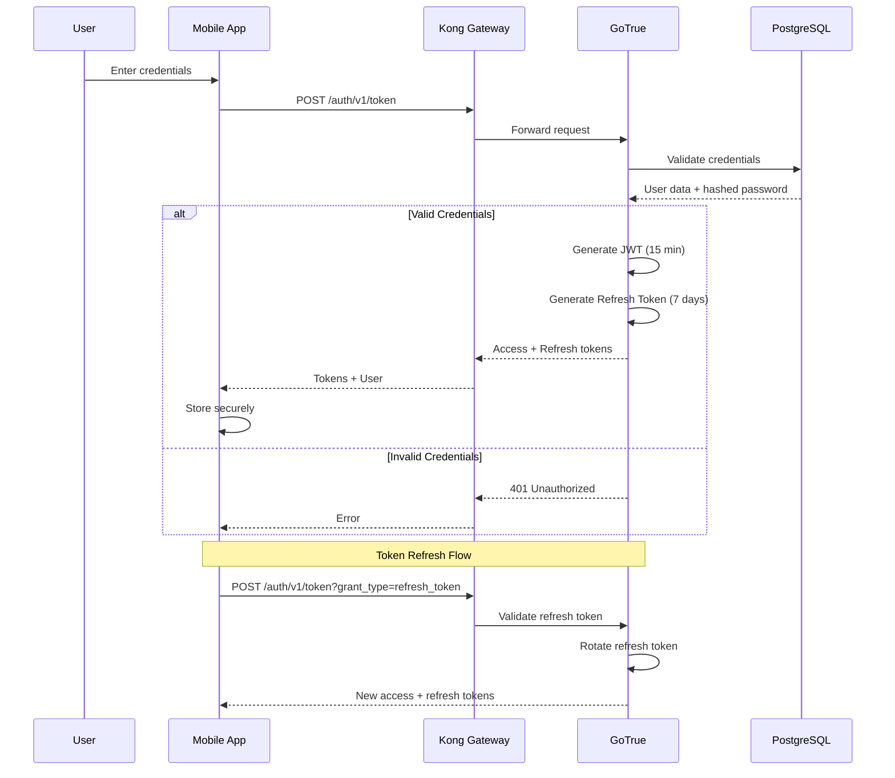
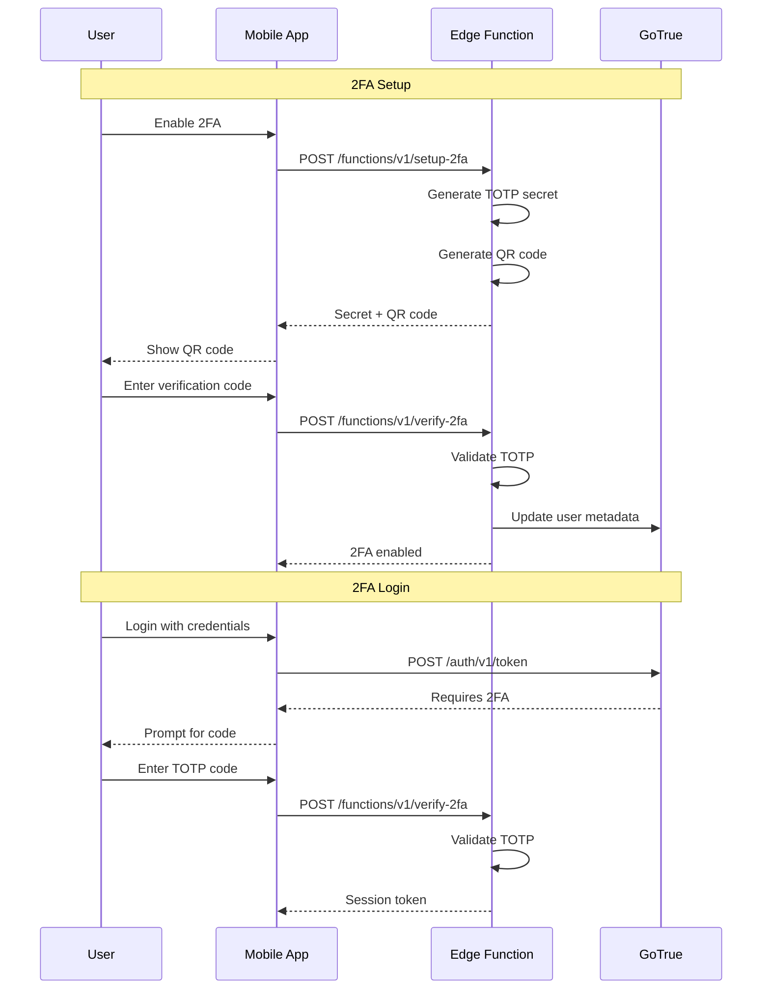
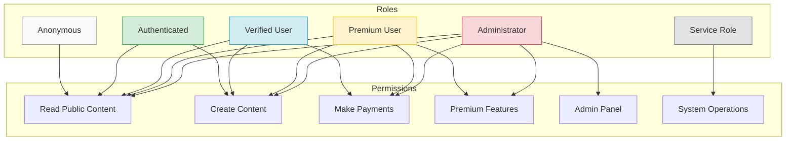
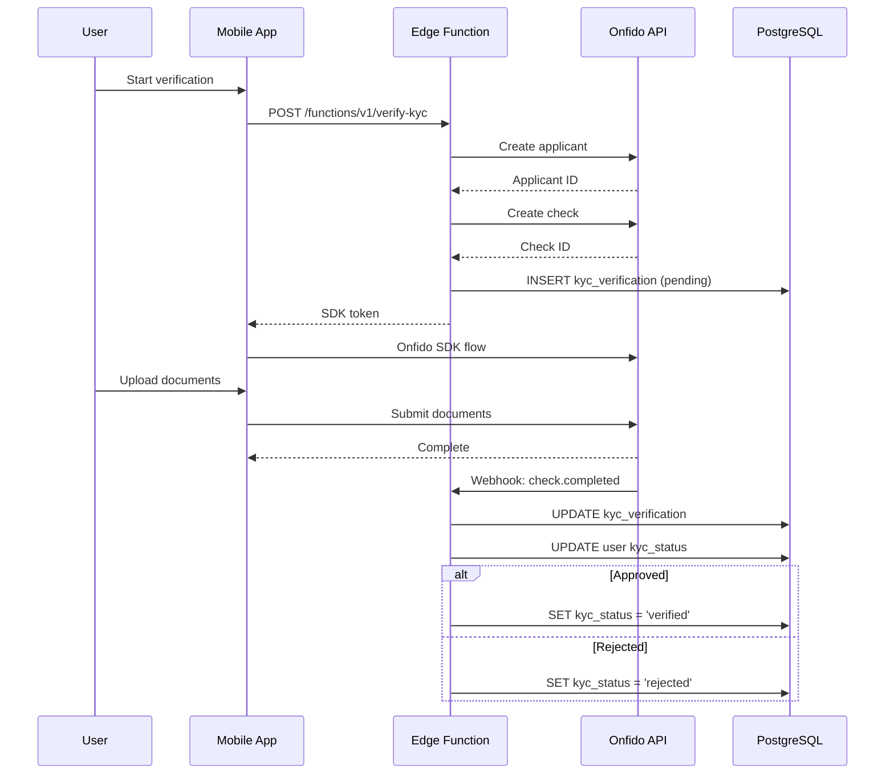

# TravelMatch Security Architecture

> **Version**: 1.0.0
> **Last Updated**: December 2024

This document describes the security architecture of TravelMatch, including authentication, authorization, data protection, and compliance measures.

## Table of Contents

1. [Security Overview](#security-overview)
2. [Authentication](#authentication)
3. [Authorization](#authorization)
4. [Data Protection](#data-protection)
5. [API Security](#api-security)
6. [Infrastructure Security](#infrastructure-security)
7. [Compliance](#compliance)
8. [Security Monitoring](#security-monitoring)
9. [Incident Response](#incident-response)

---

## Security Overview

### Security Principles

1. **Defense in Depth**: Multiple layers of security controls
2. **Least Privilege**: Minimal access rights for users and services
3. **Zero Trust**: Verify every request, trust nothing implicitly
4. **Secure by Default**: Security enabled by default, not opt-in

### Security Layers

```
┌─────────────────────────────────────────────────────────────────┐
│                        Security Layers                          │
├─────────────────────────────────────────────────────────────────┤
│  Layer 1: Network Security                                      │
│           - Cloudflare WAF                                      │
│           - DDoS Protection                                     │
│           - TLS 1.3                                             │
├─────────────────────────────────────────────────────────────────┤
│  Layer 2: API Gateway Security                                  │
│           - Rate Limiting                                       │
│           - JWT Validation                                      │
│           - CORS Policies                                       │
├─────────────────────────────────────────────────────────────────┤
│  Layer 3: Application Security                                  │
│           - Input Validation                                    │
│           - Output Encoding                                     │
│           - Error Handling                                      │
├─────────────────────────────────────────────────────────────────┤
│  Layer 4: Database Security                                     │
│           - Row Level Security                                  │
│           - Encrypted Connections                               │
│           - Parameterized Queries                               │
├─────────────────────────────────────────────────────────────────┤
│  Layer 5: Data Security                                         │
│           - Encryption at Rest                                  │
│           - Encryption in Transit                               │
│           - Key Management                                      │
└─────────────────────────────────────────────────────────────────┘
```

---

## Authentication

### Authentication Flow



### JWT Structure

```json
{
  "header": {
    "alg": "HS256",
    "typ": "JWT"
  },
  "payload": {
    "aud": "authenticated",
    "exp": 1703289600,
    "iat": 1703288700,
    "iss": "supabase",
    "sub": "user-uuid-here",
    "email": "user@example.com",
    "role": "authenticated",
    "app_metadata": {
      "provider": "email"
    },
    "user_metadata": {
      "full_name": "John Doe"
    }
  }
}
```

### Token Lifetimes

| Token Type | Lifetime | Storage | Rotation |
|------------|----------|---------|----------|
| Access Token | 15 minutes | Memory | On expiry |
| Refresh Token | 7 days | SecureStore | On use |
| Session | 7 days | Database | On refresh |

### Multi-Factor Authentication (2FA)



### OAuth Providers

| Provider | Status | Scopes |
|----------|--------|--------|
| Google | Enabled | email, profile |
| Apple | Enabled | email, name |
| Facebook | Planned | email |

### Secure Token Storage

```typescript
// Mobile app - using Expo SecureStore
import * as SecureStore from 'expo-secure-store';

const storeTokens = async (accessToken: string, refreshToken: string) => {
  await SecureStore.setItemAsync('access_token', accessToken, {
    keychainAccessible: SecureStore.WHEN_UNLOCKED_THIS_DEVICE_ONLY,
  });
  await SecureStore.setItemAsync('refresh_token', refreshToken, {
    keychainAccessible: SecureStore.WHEN_UNLOCKED_THIS_DEVICE_ONLY,
  });
};
```

---

## Authorization

### Role-Based Access Control (RBAC)



### Row Level Security (RLS)

All database tables have RLS enabled with policies based on `auth.uid()`:

```sql
-- Example: Users table policies
CREATE POLICY "Users can read own profile"
  ON users FOR SELECT
  USING (auth.uid() = id);

CREATE POLICY "Users can update own profile"
  ON users FOR UPDATE
  USING (auth.uid() = id)
  WITH CHECK (auth.uid() = id);

-- Example: Moments with blocking check
CREATE POLICY "Read non-blocked moments"
  ON moments FOR SELECT
  USING (
    status = 'active' AND
    NOT EXISTS (
      SELECT 1 FROM blocks
      WHERE (blocker_id = auth.uid() AND blocked_id = moments.user_id)
         OR (blocker_id = moments.user_id AND blocked_id = auth.uid())
    )
  );
```

### Permission Matrix

| Resource | Anonymous | Authenticated | Verified | Admin | Service |
|----------|-----------|---------------|----------|-------|---------|
| View public moments | R | R | R | R | R |
| Create moments | - | R | RW | RW | RW |
| View own profile | - | R | R | R | R |
| Update own profile | - | RW | RW | RW | RW |
| Send messages | - | - | RW | RW | RW |
| Make payments | - | - | RW | RW | RW |
| View transactions | - | R | R | R | R |
| Admin dashboard | - | - | - | RW | - |
| Delete users | - | - | - | D | D |

R = Read, W = Write, D = Delete

---

## Data Protection

### Encryption

#### In Transit

- TLS 1.3 for all connections
- Certificate pinning in mobile app
- HSTS enabled on web

```typescript
// Certificate pinning (React Native)
const sslPinning = {
  certs: ['sha256/AAAAAAAAAAAAAAAAAAAAAAAAAAAAAAAAAAAAAAAAAAA='],
};
```

#### At Rest

| Data Type | Encryption | Key Management |
|-----------|------------|----------------|
| Database | AES-256 | Supabase managed |
| File storage | AES-256 | S3/Minio managed |
| Backups | AES-256-GCM | Customer managed |
| Secrets | AES-256 | Infisical |

### Sensitive Data Handling

```typescript
// Logger with auto-redaction
import { logger } from '@/utils/logger';

// Automatically redacts:
// - Email addresses
// - Phone numbers
// - Credit card numbers
// - Passwords
// - API keys
// - JWT tokens

logger.info('User logged in', { email: user.email }); // email is redacted
```

#### Sensitive Data Patterns (33 patterns auto-redacted)

```typescript
const SENSITIVE_PATTERNS = [
  /\b[A-Za-z0-9._%+-]+@[A-Za-z0-9.-]+\.[A-Z|a-z]{2,}\b/g,  // Email
  /\b\d{4}[-\s]?\d{4}[-\s]?\d{4}[-\s]?\d{4}\b/g,           // Credit card
  /\bpassword['":\s]*['"]?[\w!@#$%^&*]+['"]?/gi,           // Password
  /\bBearer\s+[A-Za-z0-9\-_]+\.[A-Za-z0-9\-_]+\.[A-Za-z0-9\-_]+/g, // JWT
  // ... 29 more patterns
];
```

### Data Classification

| Classification | Examples | Handling |
|----------------|----------|----------|
| **Public** | Moment titles, categories | No restrictions |
| **Internal** | User IDs, moment IDs | Auth required |
| **Confidential** | Email, phone, location | RLS + encryption |
| **Restricted** | Passwords, payment data | Never logged, encrypted |

---

## API Security

### Rate Limiting

```yaml
# Kong rate limiting configuration
plugins:
  - name: rate-limiting
    config:
      minute: 100        # 100 requests per minute
      hour: 1000         # 1000 requests per hour
      policy: redis
      fault_tolerant: true
      hide_client_headers: false
```

#### Rate Limits by Endpoint

| Endpoint | Limit | Window |
|----------|-------|--------|
| `/auth/v1/token` | 5 | 1 minute |
| `/auth/v1/signup` | 3 | 1 minute |
| `/rest/v1/*` | 100 | 1 minute |
| `/storage/v1/upload` | 10 | 1 minute |
| `/functions/v1/*` | 50 | 1 minute |

### Input Validation

```typescript
// Zod schemas for all inputs
import { z } from 'zod';

const createMomentSchema = z.object({
  title: z.string().min(3).max(100).trim(),
  description: z.string().max(2000).optional(),
  category: z.enum(['adventure', 'culture', 'food', 'nature', 'social']),
  location: z.string().min(2).max(200),
  date: z.string().datetime(),
  price: z.number().min(0).max(100000),
  maxParticipants: z.number().int().min(1).max(100),
  images: z.array(z.string().url()).max(10),
});

// Validate in Edge Function
const result = createMomentSchema.safeParse(requestBody);
if (!result.success) {
  return new Response(JSON.stringify({ error: result.error }), { status: 400 });
}
```

### CORS Configuration

```yaml
# Kong CORS configuration
plugins:
  - name: cors
    config:
      origins:
        - https://travelmatch.app
        - https://admin.travelmatch.app
      methods:
        - GET
        - POST
        - PUT
        - DELETE
        - OPTIONS
      headers:
        - Accept
        - Authorization
        - Content-Type
        - X-Request-Id
      exposed_headers:
        - X-Request-Id
      credentials: true
      max_age: 3600
```

### Security Headers

```typescript
// Next.js security headers (web/admin)
const securityHeaders = [
  {
    key: 'X-DNS-Prefetch-Control',
    value: 'on',
  },
  {
    key: 'Strict-Transport-Security',
    value: 'max-age=63072000; includeSubDomains; preload',
  },
  {
    key: 'X-XSS-Protection',
    value: '1; mode=block',
  },
  {
    key: 'X-Frame-Options',
    value: 'SAMEORIGIN',
  },
  {
    key: 'X-Content-Type-Options',
    value: 'nosniff',
  },
  {
    key: 'Referrer-Policy',
    value: 'origin-when-cross-origin',
  },
  {
    key: 'Content-Security-Policy',
    value: "default-src 'self'; script-src 'self' 'unsafe-inline' 'unsafe-eval'; style-src 'self' 'unsafe-inline';",
  },
];
```

---

## Infrastructure Security

### Network Architecture

```
┌─────────────────────────────────────────────────────────────────┐
│                         Internet                                │
└─────────────────────────────────────────────────────────────────┘
                              │
                              ▼
┌─────────────────────────────────────────────────────────────────┐
│                    Cloudflare (WAF + DDoS)                      │
│  - Rate limiting       - Bot protection                         │
│  - IP reputation       - Geo-blocking                           │
│  - SSL termination     - Challenge pages                        │
└─────────────────────────────────────────────────────────────────┘
                              │
                              ▼
┌─────────────────────────────────────────────────────────────────┐
│                    VPC / Private Network                        │
│  ┌─────────────┐    ┌─────────────┐    ┌─────────────┐         │
│  │  Web Tier   │    │  API Tier   │    │  Data Tier  │         │
│  │  (Public)   │────│  (Private)  │────│  (Private)  │         │
│  └─────────────┘    └─────────────┘    └─────────────┘         │
│                                                                 │
│  Network ACLs: Only allow necessary ports between tiers         │
│  Security Groups: Instance-level firewall rules                 │
└─────────────────────────────────────────────────────────────────┘
```

### Secret Management

```yaml
# Infisical configuration
infisical:
  projectId: travelmatch
  environments:
    - dev
    - staging
    - prod
  secrets:
    - SUPABASE_SERVICE_KEY
    - STRIPE_SECRET_KEY
    - ONFIDO_API_KEY
    - JWT_SECRET
    - REDIS_PASSWORD
```

```bash
# CI/CD - fetch secrets
infisical export --env=prod --format=dotenv > .env.production
```

### Container Security

```dockerfile
# Non-root user
FROM node:20-alpine
RUN addgroup -g 1001 -S nodejs && adduser -S nextjs -u 1001
USER nextjs

# Read-only filesystem
VOLUME ["/tmp"]
```

---

## Compliance

### GDPR Compliance

| Requirement | Implementation |
|-------------|----------------|
| Right to Access | Data export endpoint |
| Right to Erasure | Soft delete + 30-day purge |
| Data Portability | JSON export of all user data |
| Consent Management | Explicit opt-in for marketing |
| Data Minimization | Only collect necessary data |
| Breach Notification | Automated alerting + process |

### Data Export

```typescript
// Edge Function: export-user-data
export async function handler(req: Request) {
  const userId = (await req.json()).userId;

  const userData = await supabase.rpc('export_user_data', {
    target_user_id: userId,
  });

  return new Response(JSON.stringify(userData), {
    headers: { 'Content-Type': 'application/json' },
  });
}
```

### KYC/AML Compliance



---

## Security Monitoring

### Audit Logging

```sql
-- Audit log table
CREATE TABLE audit_logs (
  id UUID PRIMARY KEY DEFAULT uuid_generate_v4(),
  action TEXT NOT NULL,
  entity_type TEXT NOT NULL,
  entity_id UUID,
  user_id UUID REFERENCES users(id),
  ip_address INET,
  user_agent TEXT,
  metadata JSONB,
  performed_at TIMESTAMPTZ DEFAULT NOW()
);

-- Trigger for sensitive operations
CREATE OR REPLACE FUNCTION log_sensitive_operation()
RETURNS TRIGGER
LANGUAGE plpgsql
SECURITY DEFINER
AS $$
BEGIN
  INSERT INTO audit_logs (action, entity_type, entity_id, user_id, metadata)
  VALUES (
    TG_OP,
    TG_TABLE_NAME,
    COALESCE(NEW.id, OLD.id),
    auth.uid(),
    jsonb_build_object('old', row_to_json(OLD), 'new', row_to_json(NEW))
  );
  RETURN COALESCE(NEW, OLD);
END;
$$;
```

### Security Alerts

| Event | Severity | Alert Channel |
|-------|----------|---------------|
| Failed login (5+ attempts) | High | Slack + Email |
| Password change | Medium | Email |
| 2FA disabled | High | Email + SMS |
| Large transaction | High | Slack |
| Admin action | Medium | Audit log |
| Rate limit exceeded | Low | Metrics |

### Sentry Integration

```typescript
// Error tracking with context
import * as Sentry from '@sentry/react-native';

Sentry.init({
  dsn: process.env.SENTRY_DSN,
  tracesSampleRate: 0.2,
  beforeSend(event) {
    // Scrub sensitive data
    if (event.request?.headers) {
      delete event.request.headers['Authorization'];
    }
    return event;
  },
});
```

---

## Incident Response

### Incident Classification

| Severity | Description | Response Time | Examples |
|----------|-------------|---------------|----------|
| P1 - Critical | Service down, data breach | 15 minutes | Database breach, auth failure |
| P2 - High | Major feature broken | 1 hour | Payment failures, message delivery |
| P3 - Medium | Minor feature broken | 4 hours | Search issues, slow performance |
| P4 - Low | Cosmetic issues | 24 hours | UI bugs, typos |

### Response Procedures

```
┌─────────────────────────────────────────────────────────────────┐
│                    Incident Response Flow                       │
├─────────────────────────────────────────────────────────────────┤
│  1. DETECT                                                      │
│     - Automated monitoring alerts                               │
│     - User reports                                              │
│     - Security scanning                                         │
├─────────────────────────────────────────────────────────────────┤
│  2. TRIAGE                                                      │
│     - Assess severity                                           │
│     - Identify scope                                            │
│     - Assign incident commander                                 │
├─────────────────────────────────────────────────────────────────┤
│  3. CONTAIN                                                     │
│     - Isolate affected systems                                  │
│     - Preserve evidence                                         │
│     - Block attack vectors                                      │
├─────────────────────────────────────────────────────────────────┤
│  4. ERADICATE                                                   │
│     - Remove threat                                             │
│     - Patch vulnerabilities                                     │
│     - Update credentials                                        │
├─────────────────────────────────────────────────────────────────┤
│  5. RECOVER                                                     │
│     - Restore services                                          │
│     - Verify functionality                                      │
│     - Monitor closely                                           │
├─────────────────────────────────────────────────────────────────┤
│  6. POST-MORTEM                                                 │
│     - Document timeline                                         │
│     - Identify root cause                                       │
│     - Implement improvements                                    │
└─────────────────────────────────────────────────────────────────┘
```

### Security Contacts

| Role | Responsibility | Escalation |
|------|----------------|------------|
| On-call Engineer | First response | 15 min |
| Security Lead | Incident commander | 30 min |
| CTO | Executive decisions | 1 hour |
| Legal | Breach notification | As needed |

---

## Related Documents

- [Architecture Overview](./ARCHITECTURE.md)
- [Data Architecture](./DATA_ARCHITECTURE.md)
- [ADR-005: Row Level Security](./adr/ADR-005-row-level-security.md)
- [Security Hardening Guide](../SECURITY_HARDENING.md)
